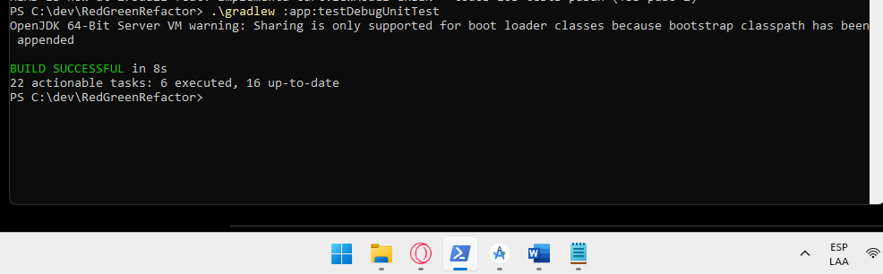

# Red-Green-Refactor: TDD para CartViewModel con MockK

## Autor

- **Nombre:** Miguel Angel Rizo Arias  
- **Programa:** Ingeniería de Sistemas  
- **Unidad:** 9 — Testing y Aseguramiento de Calidad en Aplicaciones Móviles  
- **Actividad:** Post-Contenido 1  
- **Fecha:** 06/05/2026  

---

## Descripción del Proyecto

Este proyecto fue desarrollado aplicando la metodología TDD (Test Driven Development) mediante el ciclo **Red → Green → Refactor** para construir un `CartViewModel` en Android usando Kotlin.

El propósito principal fue implementar pruebas unitarias desde el inicio del desarrollo para validar el comportamiento del ViewModel en diferentes escenarios, como carga de productos, cálculo del total, manejo de errores y transición de estados.

Para las pruebas se utilizaron herramientas como MockK, Turbine y Kotlin Coroutines Test, permitiendo aislar dependencias y verificar correctamente el flujo de datos.

---

## Objetivo

Implementar un `CartViewModel` aplicando la metodología TDD en Android Studio con Kotlin, desarrollando pruebas unitarias que permitan validar el funcionamiento de la lógica del carrito de compras.

---

## Tecnologías Utilizadas

- Kotlin 1.9.22  
- Android Studio Hedgehog  
- JUnit 5  
- MockK 1.13.9  
- Turbine 1.1.0  
- Kotlin Coroutines Test  
- Gradle 8.7  

---

## Ciclo TDD Aplicado

### RED

En esta etapa se escribieron primero las pruebas unitarias antes de desarrollar la implementación del ViewModel.

Los tests fallaron inicialmente debido a que todavía no existía la lógica necesaria, validando así que las pruebas estaban correctamente definidas.

Se probaron escenarios como:

- carga de productos  
- cálculo del total  
- manejo de errores  
- cambio de estados  

Resultado obtenido:

```text
3 tests completed, 3 failed
```

---

### GREEN

Después de tener las pruebas fallando, se desarrolló la implementación mínima necesaria para que todos los tests pasaran correctamente.

Se agregó:

- manejo de estados  
- carga del carrito  
- cálculo del total  
- captura de excepciones  

Resultado:

```text
BUILD SUCCESSFUL
```

---

### REFACTOR

Con todos los tests funcionando correctamente, se realizó una refactorización para mejorar la organización y legibilidad del código sin alterar su funcionamiento.

Se aplicaron mejoras como:

- extracción de funciones  
- uso de `runCatching`  
- validación de listas vacías  
- limpieza del código  

También se agregó una prueba adicional para validar escenarios límite.

---

## Estructura del Proyecto

```text
app/src/main/java/com/universidad/red_green_refactor/

├── domain
│   ├── model
│   └── repository
│
└── ui
    └── cart
```

### Pruebas Unitarias

```text
app/src/test/java/com/universidad/red_green_refactor/ui/cart/
```

---

## Ejecución de Tests

Ejecutar desde la terminal de Android Studio o PowerShell:

```bash
./gradlew :app:testDebugUnitTest
```

Resultado esperado:

```text
BUILD SUCCESSFUL
4 tests completed, 0 failed
```

---

## Escenarios Validados

- carga correcta del carrito  
- cálculo total de productos  
- manejo de errores de red  
- transición Loading → Success  
- validación de listas vacías  

---
## Capturas de Resultados

Las capturas se encuentran en la carpeta `/evidencias/`:

### Barra Roja en Android Studio


### Barra Verde en Android Studio



### Estado Refactor


## Conclusión

Este proyecto permitió aplicar correctamente la metodología TDD en Android utilizando Kotlin y pruebas unitarias. Gracias al desarrollo guiado por pruebas fue posible validar el comportamiento del `CartViewModel` desde las primeras etapas, mejorando la calidad del código y facilitando su mantenimiento.
